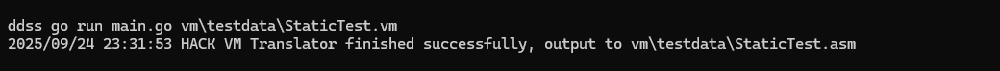

# HACK VM Translator (Golang)

Simple (zero dependency) implementation of the VM Translator for the HACK Assembly language, as part of the course [Nand to Tetris](https://www.nand2tetris.org/), written in Golang.

## VM Language
 


## Logical-Arithmetic operations


## Standard VM mapping
 


## How to use

The `vm/testdata` folder includes a few examples of valid HACK VM files.

In order to run the translator, the following is required:

* Golang >= v1.25.0

Example:

```shell
go run main.go vm/testdata/BasicTest.vm
```

Usage:

```plaintext
Usage of hackvmtranslator:

  main vm\testdata\FileName.vm
```

The program will generate a HACK Assembly file on the path `vm\testdata\FileName.asm`.

## Screenshot



## Building

In order to submit projects to Coursera, I decided to create a fake Makefile and submit the Linux executable directly. In order to make that portable (I'm running Windows :confounded:), I created a Dockerfile to generate the proper binary (it's better than trying go multiplatform build).

Just run:

```shell
# building
docker build -t dd-hack-vmtranslator .
# running
docker run -d dd-hack-vmtranslator
# grab the container ID and run
docker cp $CONTAINER:/app/VMTranslator .
```

## Copyright

The HACK VM Language and it's specification, are part of the course Nand to Tetris ([https://www.nand2tetris.org/](https://www.nand2tetris.org/)) - copyright Noam Nisan and Shimon Schocken